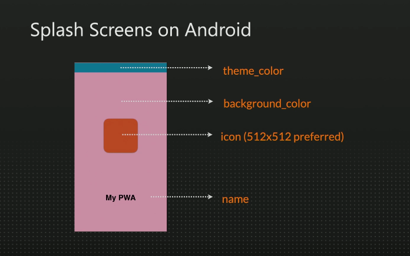

## What is a Progressive Web App ?

Design Pattern to use different APIs and specs from the Web Platform
to create installable , offline-capable standalone apps for mobile and
desktop devices.

> Ideal for all those apps that consume web content or web services.

> It's not an API or a framework , just a term to describe a design Pattern

> Web Apps, installable Web Apps, Home screen Web Apps.

## App Development Approaches

- Native SDKs ------------------------------- Device
  - Hybrid Development -------------------- Device
- Web Development --------------------------- Browser
- Web Development (PAW) --------------------- Device & Browser

## From the Web Universe

- Links and discoverability
- Easy to deploy
- Easy to update
- Standards and tools

## From the Native Universe

- Offline access
- Installed icon adn standalone
- OS integration
- Performance and UX

PAW have the both Native and Web.

## State of Platform

- Android
  - All web browsers
- iOS and iPadOS
  - Safari
  - Other browsers: with a twist
- Huawei HarmonyOS
  - Native Browser
- Meta Horizon OS
  - Meta Store
- macOs
  - Safari,Chrome,Edge
- Linux
  - Chrome , Edge
- ChromeOS
  - Chrome
- Windows 7,8,x,10,11
  - Chrome,Edge

## No support or plans for it

- Firefox on desktop
- visionOS
- iOS WebView (Instagram , TikTok, etc..)
- watchOS
- tvOS
- Android TV

## Components of a PWA

- Web App
- Web App Manifest
- Service Worker

> The concept is changing with time and it's becoming more flexible

### PWA Levels

- Default
- Basic Metadata provided
- PWA Criteria Approved
- Full offline experience

### PWA Criteria

Defined by the browser. If passed , there are hints , banners , dialogs
or bars explaining to the user that the current web app is installable and
inviting them to install it.

### Installability Criteria

- Safari on iOS and iPadOs
  - Includes meta data with:
  - App's name
  - Icons
  - Start URL
  - Display mode
- Safari on macOs
  - No Requirements
- Chromium
  - Web app not already installed
  - HTTPS
  - Meet basic engagement heuristics
  - Includes meta data with:
  - App's name
  - Icons
  - Start URL
  - Display mode
- Firefox Android-only
  - Web app not already installed
  - HTTPS
  - Includes meta data with:
  - App's name
  - Icons
  - Start URL
  - Display mode

> On mobile if you don't meet the basic criteria, standalone installation
> won't happen. On desktop there are ways to install them as web app.

## Web App Manifest

It's a JSON file that defines all the meta data that will help the browser and
the OS to install the app and have integration into the operating system.

## Web App Manifest

- W3C spec
- JSON file
- Default extension: webmanifest
- MIME type: application/manifest+json or application/json
- We have to link it from the HTML (all the document you want)

### Web App Manifest Basics

```html
<link rel="manifest" href="web.manifest" />
```

> You can have more than one installable web app (PWA) in the same origin,
> if you point to different Web App Manifest files. It's recommended to host
> them in different folders.

> It allows to the micro-app architectural pattern.

## Inside Web app manifest

- **id:** you have to add id at first and mostly we add slash
- **start_url:** maybe user install our app from about page we don't want that to be home page
  so we add start_url if you don't do it it will package the page that user create paw from it.
- **scope:** if user open the link out side of your app it will add your pwa then that other link inside
  that don't let user leave the page
- then we have name and short_name
- **display: ** most add standalone

```json
{
  "id": "/",
  "start_url": "/",
  "scope": "/",
  "name": "CodepadMasters, the best notepad for your device",
  "short_name": "CodepadM",
  "display": "standalone",
  "theme_color": "#55887c"
}
```

> There is no standard way to internationalize your web
> app's metadata using the manifest. You can link to several
> manifests or create the manifest dynamically from the server.

## Display Modes

- browser (default)
- standalone (common for PWA)
- fullscreen (works only on Android)
- minimal-ui (fallback to browsers)

On a separate spec

- tabbed
- window-controls-overlay

> For backward compatibility you cna use a standard mode in display and other modes in
> display_override as in:
> "display_override": ["tabbed"]

## Icons on Android

### Shortcut

- Creates a shortcut to browsers's engine
- It's installed only at the home screen
- No icon in the launcher
- It doesn't appear at app's list
- All browsers use this method by default
- Browser's badge (Android 8+)

### Web APK

- Only if PWA Criteria passes
- It's full Android native package
- It contains only metadata
- APK is installed silently
- Icon to home screen and launcher
- Google Chrome with Play Services
- Internet on Samsung devices
- HarmonyOS Huawei devices (similar idea)

## Icons in the Web App Manifest

```json
"icons": [
  {
    "src": "icon.png",
    "sizes": "192x192",
    "type": "image/png"
  },
   {
    "src": "icon.png",
    "sizes": "512x512",
    "type": "image/png"
  }
]
```

### Recommendations for icons in Manifest

- Format : PNG , Color space SRGB
- Used on Android and desktop OS
- If there is no exact icon available it will pick the closest one
- Recommendations sizes
  - At least : 192x192,512x512,1024x1024
  - Deprecated sizes : 72x72,152x152,384x384

### icons in new versions

- Format SVG
- Used on Android Web APK on some devices
- Used on desktop on some operating systems

### Maskable

- Format Maskable PNG
- Used on Android 8+ by default
- Logo is designed with icon masks and safe zone in mind,
  such that any part of the image that is outside the
  safe zone can safely be ignored and masked away

> Maskable Icons will solve the problem of different shapes; it's still
> a square icon but with enough discardable padding content out of the safe area

here how we say this icon is maskable

```json
"icons": [
  {
    "src": "icon.png",
    "sizes": "192x192",
    "type": "image/png"
  },
   {
    "src": "maskable.png",
    "sizes": "512x512",
    "type": "image/png",
    "purpose": "maskable"
  }
]
```

### Wep App Icons for iOS and iPadOS

- They will use an icon from the manifest
- We can specify an specific icon for these platforms by using a
  **link** in the HTML element

## Icon for iOS

the recommended size is 180x180 you can specify multiply but add only one
with the size mentioned

```html
<link rel="app-touch-icon" href="ios_icon.png" />

<link rel="app-touch-icon" href="ios_icon.png" sizes="120x120" />
```

## Splash Screen

Mobile app design pattern that renders a static image while the app
process is loading

### Splash Screens for Android

- They are automatically generated
- You can't provide your own image
- They use the meta data from the Web App Manifest



### Splash Screen for iOS and iPadOS

- Safari won't use the App Manifest meta data
- It let us create our own static images.
- They are known as Startup Images
- We define them through a **link**
- We must use a deprecated meta tag
- It must match exactly the current device's screen size
- On iPad it gets more complicated

```html
<meta name="apple-mobile-web-app-capable" content="yes" />

<link rel="apple-touch-startup-image" href="splash.png" />
```

> The problem on Safari is that it needs the image with the exact
> size of the device's screen

### Startup Images for iOS

- iPhone SE
- iPhone 7,8,SE 2nd edition
- iPhone X,XS,11 Pro ,12 Pro , 13 Pro , 14 Pro , 15 Pro
- iPhone XR , 11 , 12 , 13
- iPhone 7 Plus , 8 Plus
- iPhone X Max, XS Max , 11 Pro Max , 12 Pro Max , 13 Pro Max ,
  14 Pro Max , 15 Pro Max
- More iPhones coming

### Startup Images for iOS Landscape 
- iPhone 7 Plus , 8 Plus 
- iPhone X Max, XS Max , 11 Pro Max , 12 Pro Max , 13 Pro Max ,
  14 Pro Max , 15 Pro Max

### Startup Images for iPadOS
- Several iPads available 
- Portrait and Landscape 
- Split View 
- Side View 
- Any size?

> Brace yourself for more than 20 versions of the splash screen

### Client Side Generator
- Use **canvas** and Data URI to create the images on the fly 
- Use PWACompat: 
  - Open source library by Chrome 
  - It takes the App Manifest and generates assets for other browsers 
  - It generates Apple's custom assets, including 
  startup images on the fly with JavaScript 
  - It emulates Android splash screens for iOS

## Service Worker 

> A JavaScript file running in its own thread that will act as a middleware 
offering a local installed web server or web proxy for your PWA, including 
resources and API calls. 

- Runs client-side in browsers engine
- HTTPS required
- Installed by a web page 
- Own thread and lifecycle 
- Acts as a network proxy or local web server in the name of the real server 
- Abilities to run in the background 
- No need for user's permission

### Scope 
An origin (host and port) and a path https://mydomain.com or https://domain.com/myapp
